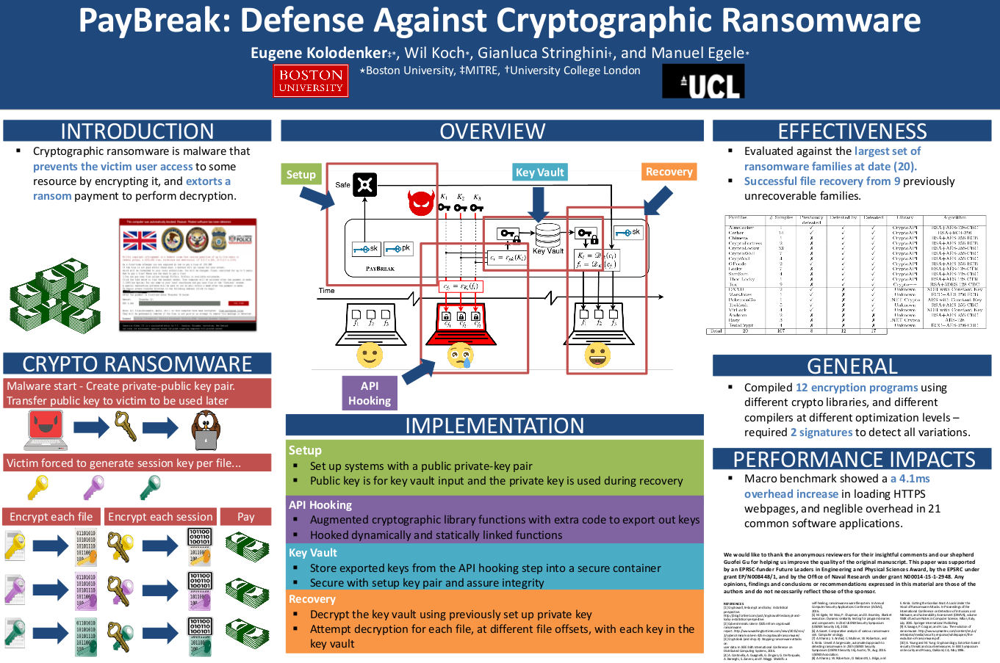

PayBreak
========
Defense against cryptographic ransomware.

Presented at ACM ASIACCS 2017. Paper can be found here: [PayBreak](https://eugenekolo.com/static/paybreak.pdf)

```
Kolodenker, Eugene, William Koch, Gianluca Stringhini, and Manuel Egele.
"PayBreak: Defense against cryptographic ransomware." In Proceedings of the 2017
ACM Asia Conference on Computer and Communications Security (ASIACCS). ACM
(Association for Computing Machinery), 2017.
```



Build
-----
```
cl /LD antiransom.cpp
```

Installation
------------
Copy `antiransom.dll` to `C:\antiransom.dll` (Must be root directory for least amount of issues)

In registry set:
`HKEY_LOCAL_MACHINE\Software\Microsoft\Windows NT\CurrentVersion\Windows\AppInit_DLLs` to `C:\antiransom.dll`  
`HKEY_LOCAL_MACHINE\Software\Microsoft\Windows NT\CurrentVersion\Windows\LoadAppInit_DLLs` to `1`

Round trip demo
---------------
```
# Build and install the antiransom.dll
cl /LD antiransom.cpp
mv antiransom.dll "C:"

# Build and run a sample encrypter
cl ./test/kEncrypt.cpp ./test/easy_cryptoapi.cpp  
kEncrypt.exe ./test/test1.txt test1.enc no

# Check the log and extract the key data
grep ExfilKeyData "C:/CryptoHookLog.dll"

# Decrypt using the extracted data and compare to the original (should be same)
./scripts/decrypt-file.py -f test1.enc -o test1.out -x <keydata>
diff test1.out ./test/test1.txt
```
